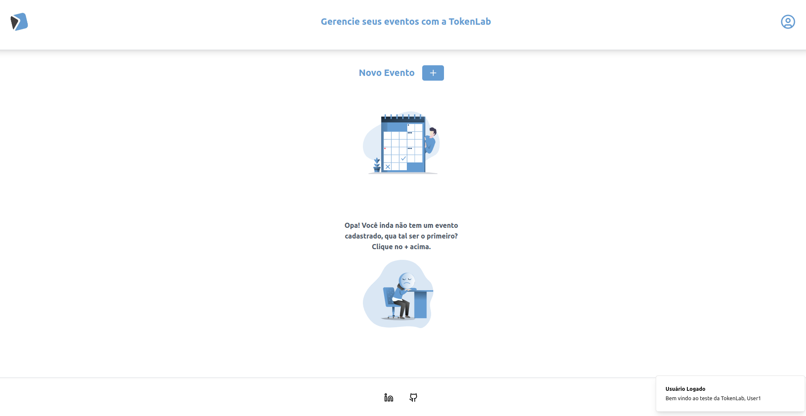

# tokenlab-danilo-test

This is a test for fullstack developer in TokenLab made in a week, and with more time I will refactor and add more features (probably).

This is a fullstack application built with the fammous MERN STACK. It' is a simulation for an event tracking app, with full authentication, user creation, event creation and edition, validation for event dates overlaping (for user and for guests) and so on...

## Front-end

The front-end of this application is developed using:

- Vite: a fast build tool for modern web development.
- React: a popular JavaScript library for building user interfaces (SPA approach).
- Formik: a library for building forms with React.
- Yup: a schema validation library.
- Tailwind CSS: a utility-first CSS framework.
- React Query: a library for fetching and managing async data in React applications.

## Back-end

The back-end of this application is developed using:

- Node.js: a JavaScript runtime for server-side development.
- Express: a fast and minimalist web application framework for Node.js.
- MongoBD: a NoSql lightweight database.

## Getting Started

> :warning: **WARNING 1**: This monorepo requires Node.js v18+. Please ensure you have this version installed before proceeding.

> :warning: **WARNING 2**: This monorepo requires an instance of a Mongodb database running in your machine, cloud or in a container. Please make sure you have the procces running and add a .env file with a MONGO_DB_URI=here-goes-your-mongodb-string-uri. (with more time I will put this DB in a container image to avoid this step)

To get started with this project, follow the steps below:

1. Clone the repository.

```bash
git clone https://github.com/Danilo-Guedes/tokenlab-danilo-test.git
```

2. cd into the project folder.

```bash
cd tokenlab-danilo-test
```

3. cd into /client folder, install the dependencies and start the application.

```bash
cd client/ && npm install && npm run dev
```

4. Open a new terminal, cd into /server folder, install de depenencies and start de application.

```bash
cd server/ && npm install && npm run dev
```

5. Open the browser at http://localhost:5173/ (default port for vite apps).

6. Start use the application.

## What I would do if I had more time ?

1. Adopt a DDD or Clean Architecture approach to prepare the code for a healthier and growth.
2. As you create the domain entities, make better use of OOP and making sure the core functionalities are not coupled with third party libraries, making sure the code is easier to maintain and easier to test.
3. Write tests for the application.
4. Create a class to standardize backend errors.
5. If it were a real project, I would be using TypeScript instead of vanilla JavaScript.
6. I would put all the code into a container so the development enviroment gets easier to setup.
7. Add better loading states (skeletons and spinners) and of course add small animation to make the UI and UX even more friendly.

## Screenshots





## License

This project is licensed under the [MIT License](LICENSE).
